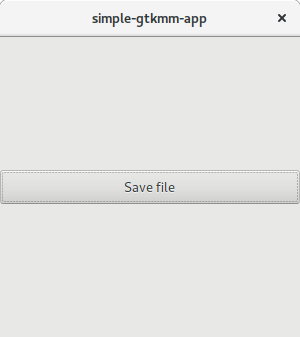

# A test program for saving files using GtkFileChooserNative and Gtkmm



## Build and run

```bash
git clone https://github.com/junrrein/flatpak-saving-file.git
flatpak remote-add --from gnome https://sdk.gnome.org/gnome.flatpakrepo
flatpak install gnome org.gnome.Platform//3.28
flatpak install gnome org.gnome.Sdk//3.28
flatpak-builder --repo=flatpak-bug-repo flatpak-bug flatpak-saving-file/com.sharedpointer.simple-gtkmm-app.json --force-clean
flatpak --user remote-add --no-gpg-verify --if-not-exists flatpak-bug-repo flatpak-bug-repo
flatpak --user install flatpak-bug-repo com.sharedpointer.simple-gtkmm-app
flatpak run --command=bash com.sharedpointer.simple-gtkmm-app
export LANG=en_US
simple-gtkmm-app
```

When the file is saved succesfully, the following console output is shown:

```
Target filepath: /run/user/1000/doc/8e667a75/text file.txt
Saving using g_file_replace_contents
Success
Saving using g_file_copy
Success
Saving using g_file_move
Success
```

When saving the file fails, the following is shown:

```
Target filepath: /run/user/1000/doc/8e667a75/text file.txt
Saving using g_file_replace_contents
Error opening file “/run/user/1000/doc/8e667a75/text file.txt”: No such file or directory
Saving using g_file_copy
Error opening file “/run/user/1000/doc/8e667a75/text file.txt”: No such file or directory
Saving using g_file_move
Error opening file “/run/user/1000/doc/8e667a75/text file.txt”: No such file or directory
```

## Cleaning up

```bash
flatpak --user uninstall com.sharedpointer.simple-gtkmm-app
flatpak --user remote-delete flatpak-bug-repo
rm -rf flatpak-bug-repo/ flatpak-saving-file/
```

## Acknowledgments

Sample project using Gtkmm and Flatpak taken from https://github.com/futuretim/simple-gtkmm-flatpak-app/.
